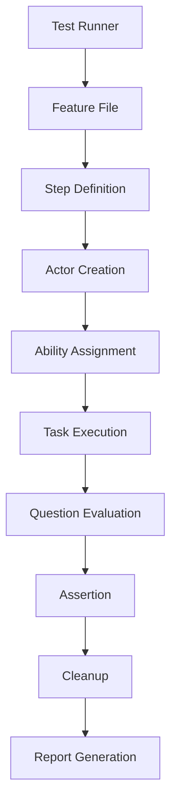
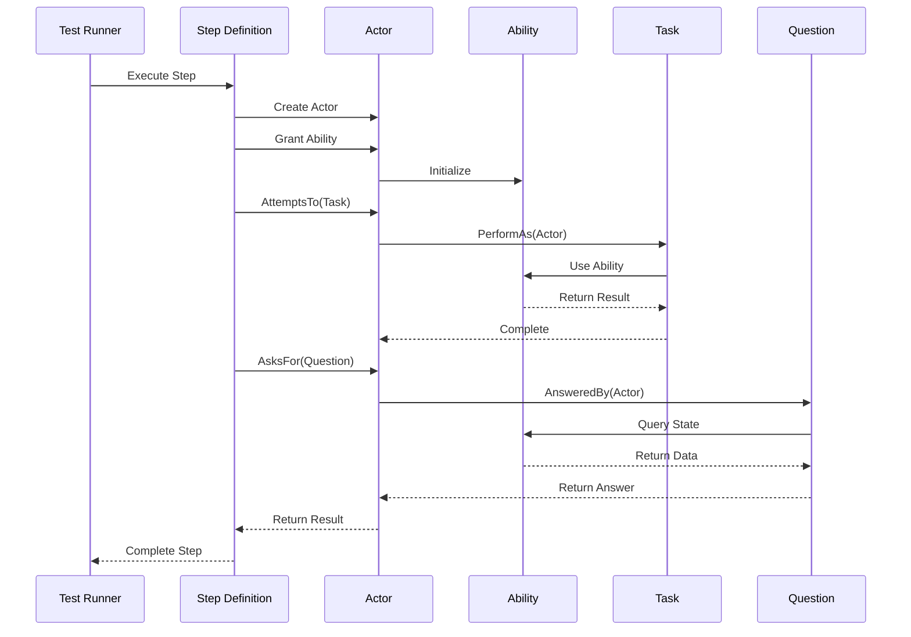
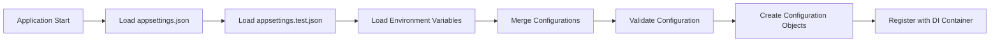
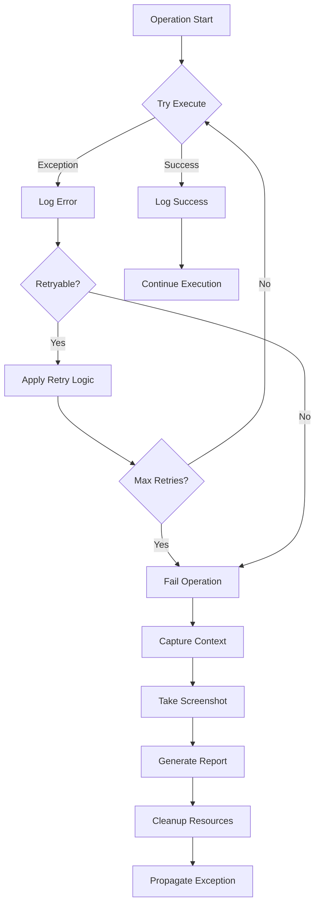

# Azure ML Workspace Testing Framework - Architecture Documentation

## Table of Contents
1. [Architecture Overview](#architecture-overview)
2. [Design Patterns](#design-patterns)
3. [System Components](#system-components)
4. [Data Flow](#data-flow)
5. [Integration Architecture](#integration-architecture)
6. [Security Architecture](#security-architecture)
7. [Scalability and Performance](#scalability-and-performance)
8. [Deployment Architecture](#deployment-architecture)
9. [Monitoring and Observability](#monitoring-and-observability)
10. [Future Architecture Considerations](#future-architecture-considerations)

## Architecture Overview

### High-Level Architecture

The Azure ML Workspace Testing Framework follows a layered architecture pattern with clear separation of concerns:

```
┌─────────────────────────────────────────────────────────────┐
│                    Presentation Layer                       │
│  ┌─────────────────┐  ┌─────────────────┐  ┌─────────────┐ │
│  │   BDD Features  │  │  Step Definitions│  │  Test Runner│ │
│  │   (Gherkin)     │  │   (Reqnroll)    │  │   (NUnit)   │ │
│  └─────────────────┘  └─────────────────┘  └─────────────┘ │
└─────────────────────────────────────────────────────────────┘
                                │
┌─────────────────────────────────────────────────────────────┐
│                   Business Logic Layer                     │
│  ┌─────────────────┐  ┌─────────────────┐  ┌─────────────┐ │
│  │     Actors      │  │      Tasks      │  │  Questions  │ │
│  │  (Screenplay)   │  │   (Actions)     │  │ (Assertions)│ │
│  └─────────────────┘  └─────────────────┘  └─────────────┘ │
└─────────────────────────────────────────────────────────────┘
                                │
┌─────────────────────────────────────────────────────────────┐
│                   Service Layer                            │
│  ┌─────────────────┐  ┌─────────────────┐  ┌─────────────┐ │
│  │   Abilities     │  │   Utilities     │  │Configuration│ │
│  │ (Capabilities)  │  │   (Helpers)     │  │ Management  │ │
│  └─────────────────┘  └─────────────────┘  └─────────────┘ │
└─────────────────────────────────────────────────────────────┘
                                │
┌─────────────────────────────────────────────────────────────┐
│                 Infrastructure Layer                       │
│  ┌─────────────────┐  ┌─────────────────┐  ┌─────────────┐ │
│  │   Azure SDK     │  │   Playwright    │  │   Logging   │ │
│  │  Integration    │  │   Browser       │  │  Framework  │ │
│  └─────────────────┘  └─────────────────┘  └─────────────┘ │
└─────────────────────────────────────────────────────────────┘
```

### Core Architectural Principles

1. **Separation of Concerns**: Each layer has distinct responsibilities
2. **Dependency Inversion**: High-level modules don't depend on low-level modules
3. **Single Responsibility**: Each component has one reason to change
4. **Open/Closed Principle**: Open for extension, closed for modification
5. **Interface Segregation**: Clients depend only on interfaces they use
6. **Liskov Substitution**: Derived classes must be substitutable for base classes

### Technology Stack

```
┌─────────────────────────────────────────────────────────────┐
│                    Technology Stack                        │
├─────────────────────────────────────────────────────────────┤
│ Testing Framework    │ NUnit 4.2.2                        │
│ BDD Framework        │ Reqnroll 2.1.0                     │
│ Browser Automation   │ Playwright 1.49.0                  │
│ .NET Runtime         │ .NET 8.0                           │
│ Dependency Injection │ Microsoft.Extensions.DI 9.0.0      │
│ Configuration        │ Microsoft.Extensions.Configuration  │
│ Logging              │ Serilog 4.2.0                      │
│ Azure Integration    │ Azure SDK for .NET                 │
│ Assertions           │ FluentAssertions 6.12.2            │
│ Test Data            │ Bogus 35.6.1, AutoFixture 4.18.1  │
│ HTTP Client          │ Microsoft.Extensions.Http 8.0.0    │
│ Retry Logic          │ Polly 8.4.2                        │
│ Reporting            │ Allure 2.12.1                      │
└─────────────────────────────────────────────────────────────┘
```

## Design Patterns

### 1. Screenplay Pattern

The Screenplay pattern is the core architectural pattern that organizes test code around user interactions:

```csharp
// Pattern Structure
Actor → Can(Ability) → AttemptsTo(Task) → Using(Ability) → AsksFor(Question)

// Implementation Example
var dataScientist = Actor.Named("Alice", logger)
    .Can(UseAzureML.AsContributor())
    .Can(BrowseTheWeb.Using(browser));

await dataScientist
    .AttemptsTo(OpenWorkspace.Named("ml-workspace"))
    .And(StartCompute.Named("test-compute"))
    .Should(Validate.ComputeStatus("test-compute", "Running"));
```

**Benefits:**
- High readability and maintainability
- Clear separation between what (tasks) and how (abilities)
- Reusable components across different test scenarios
- Natural language-like test code

### 2. Factory Pattern

Used extensively for creating instances of abilities, tasks, and questions:

```csharp
// Ability Factory
public static class AbilityFactory
{
    public static UseAzureML CreateAzureMLAbility(string role)
    {
        return role switch
        {
            "Owner" => UseAzureML.AsOwner(),
            "Contributor" => UseAzureML.AsContributor(),
            "Reader" => UseAzureML.AsReader(),
            _ => UseAzureML.WithRole(role)
        };
    }
}

// Task Factory
public static class TaskFactory
{
    public static ITask CreateComputeTask(string action, string computeName)
    {
        return action.ToLower() switch
        {
            "start" => StartCompute.Named(computeName),
            "stop" => StopCompute.Named(computeName),
            "restart" => RestartCompute.Named(computeName),
            _ => throw new ArgumentException($"Unknown action: {action}")
        };
    }
}
```

### 3. Builder Pattern

Used for complex configuration and test data creation:

```csharp
public class TestConfigurationBuilder
{
    private readonly TestConfiguration _config = new();

    public TestConfigurationBuilder WithAzureSubscription(string subscriptionId)
    {
        _config.Azure.SubscriptionId = subscriptionId;
        return this;
    }

    public TestConfigurationBuilder WithWorkspace(string workspaceName)
    {
        _config.Azure.WorkspaceName = workspaceName;
        return this;
    }

    public TestConfigurationBuilder WithBrowser(string browserType)
    {
        _config.Playwright.BrowserType = browserType;
        return this;
    }

    public TestConfiguration Build() => _config;
}

// Usage
var config = new TestConfigurationBuilder()
    .WithAzureSubscription("sub-123")
    .WithWorkspace("test-workspace")
    .WithBrowser("chromium")
    .Build();
```

### 4. Strategy Pattern

Used for different authentication and execution strategies:

```csharp
public interface IAuthenticationStrategy
{
    Task<TokenCredential> GetCredentialAsync();
}

public class InteractiveAuthStrategy : IAuthenticationStrategy
{
    public async Task<TokenCredential> GetCredentialAsync()
    {
        return new InteractiveBrowserCredential();
    }
}

public class ServicePrincipalAuthStrategy : IAuthenticationStrategy
{
    private readonly string _clientId;
    private readonly string _clientSecret;
    private readonly string _tenantId;

    public async Task<TokenCredential> GetCredentialAsync()
    {
        return new ClientSecretCredential(_tenantId, _clientId, _clientSecret);
    }
}
```

### 5. Observer Pattern

Used for test execution monitoring and reporting:

```csharp
public interface ITestExecutionObserver
{
    Task OnTestStarted(TestContext context);
    Task OnTestCompleted(TestResult result);
    Task OnTestFailed(TestFailure failure);
}

public class TestReportingObserver : ITestExecutionObserver
{
    public async Task OnTestStarted(TestContext context)
    {
        // Log test start, capture initial state
    }

    public async Task OnTestCompleted(TestResult result)
    {
        // Generate reports, capture final state
    }

    public async Task OnTestFailed(TestFailure failure)
    {
        // Capture screenshots, logs, traces
    }
}
```

### 6. Command Pattern

Tasks implement the Command pattern for encapsulating actions:

```csharp
public abstract class BaseTask : ITask
{
    public abstract string Name { get; }
    
    public async Task PerformAs(IActor actor)
    {
        await ExecuteAsync(actor);
    }

    protected abstract Task ExecuteAsync(IActor actor);
    
    // Template method for common behavior
    protected virtual async Task BeforeExecute(IActor actor) { }
    protected virtual async Task AfterExecute(IActor actor) { }
}

public class StartCompute : BaseTask
{
    private readonly string _computeName;
    
    public override string Name => $"Start compute instance '{_computeName}'";
    
    protected override async Task ExecuteAsync(IActor actor)
    {
        var azureML = actor.Using<UseAzureML>();
        await azureML.StartCompute(_computeName);
    }
}
```

## System Components

### 1. Actor System

The Actor is the central orchestrator that manages abilities and executes tasks:

```csharp
┌─────────────────────────────────────────────────────────────┐
│                        Actor                               │
├─────────────────────────────────────────────────────────────┤
│ - Name: string                                             │
│ - Abilities: ConcurrentDictionary<Type, IAbility>         │
│ - Memory: ConcurrentDictionary<string, object>            │
│ - Logger: ILogger<Actor>                                   │
├─────────────────────────────────────────────────────────────┤
│ + Can<T>(ability: T): IActor                              │
│ + Using<T>(): T                                           │
│ + AttemptsTo(task: ITask): Task<IActor>                   │
│ + AsksFor<T>(question: IQuestion<T>): Task<T>             │
│ + Should(question: IQuestion<bool>): Task<IActor>         │
│ + Remember<T>(key: string, value: T): void                │
│ + Recall<T>(key: string): T                               │
└─────────────────────────────────────────────────────────────┘
```

**Key Features:**
- Thread-safe ability and memory management
- Comprehensive logging and error handling
- Fluent API for readable test code
- Automatic resource cleanup

### 2. Ability System

Abilities define what an actor can do and encapsulate external system interactions:

```csharp
┌─────────────────────────────────────────────────────────────┐
│                      IAbility                             │
├─────────────────────────────────────────────────────────────┤
│ + Name: string                                             │
│ + InitializeAsync(): Task                                  │
│ + CleanupAsync(): Task                                     │
└─────────────────────────────────────────────────────────────┘
                                │
                ┌───────────────┼───────────────┐
                │               │               │
┌───────────────▼────┐ ┌────────▼────────┐ ┌───▼──────────┐
│   UseAzureML       │ │ UseAzureAISearch│ │ BrowseTheWeb │
├────────────────────┤ ├─────────────────┤ ├──────────────┤
│ - ArmClient        │ │ - SearchClient  │ │ - Browser    │
│ - Workspace        │ │ - IndexClient   │ │ - Page       │
│ - Credential       │ │ - Endpoint      │ │ - Context    │
├────────────────────┤ ├─────────────────┤ ├──────────────┤
│ + StartCompute()   │ │ + SearchAsync() │ │ + NavigateTo()│
│ + StopCompute()    │ │ + IndexDocs()   │ │ + ClickAsync()│
│ + GetStatus()      │ │ + DeleteIndex() │ │ + FillAsync() │
└────────────────────┘ └─────────────────┘ └──────────────┘
```

### 3. Task System

Tasks represent high-level business actions that actors can perform:

```csharp
┌─────────────────────────────────────────────────────────────┐
│                       ITask                                │
├─────────────────────────────────────────────────────────────┤
│ + Name: string                                             │
│ + PerformAs(actor: IActor): Task                           │
└─────────────────────────────────────────────────────────────┘
                                │
        ┌───────────────────────┼───────────────────────┐
        │                       │                       │
┌───────▼────────┐ ┌────────────▼─────┐ ┌──────────────▼───┐
│ OpenWorkspace  │ │  StartCompute    │ │  StopCompute     │
├────────────────┤ ├──────────────────┤ ├──────────────────┤
│ - WorkspaceName│ │ - ComputeName    │ │ - ComputeName    │
├────────────────┤ ├──────────────────┤ ├──────────────────┤
│ + Named()      │ │ + Named()        │ │ + Named()        │
│ + PerformAs()  │ │ + PerformAs()    │ │ + PerformAs()    │
└────────────────┘ └──────────────────┘ └──────────────────┘
```

### 4. Question System

Questions query the system state and return typed results:

```csharp
┌─────────────────────────────────────────────────────────────┐
│                    IQuestion<T>                            │
├─────────────────────────────────────────────────────────────┤
│ + Question: string                                         │
│ + AnsweredBy(actor: IActor): Task<T>                       │
└─────────────────────────────────────────────────────────────┘
                                │
        ┌───────────────────────┼───────────────────────┐
        │                       │                       │
┌───────▼────────────┐ ┌────────▼──────────┐ ┌─────────▼─────┐
│ ComputeStatus      │ │  WorkspaceExists  │ │  ResultCount  │
│ : IQuestion<bool>  │ │  : IQuestion<bool>│ │ : IQuestion<int>│
├────────────────────┤ ├───────────────────┤ ├───────────────┤
│ - ComputeName      │ │ - WorkspaceName   │ │ - Selector    │
│ - ExpectedStatus   │ │                   │ │               │
├────────────────────┤ ├───────────────────┤ ├───────────────┤
│ + Of()             │ │ + Named()         │ │ + Of()        │
│ + AnsweredBy()     │ │ + AnsweredBy()    │ │ + AnsweredBy()│
└────────────────────┘ └───────────────────┘ └───────────────┘
```

### 5. Configuration System

Hierarchical configuration management with multiple sources:

```csharp
┌─────────────────────────────────────────────────────────────┐
│                Configuration Hierarchy                     │
├─────────────────────────────────────────────────────────────┤
│ 1. Environment Variables (Highest Priority)               │
│ 2. appsettings.test.json                                  │
│ 3. appsettings.json (Lowest Priority)                     │
└─────────────────────────────────────────────────────────────┘
                                │
┌─────────────────────────────────────────────────────────────┐
│                TestConfiguration                           │
├─────────────────────────────────────────────────────────────┤
│ + Azure: AzureConfiguration                                │
│ + Playwright: PlaywrightConfiguration                     │
│ + Logging: LoggingConfiguration                            │
│ + Reporting: ReportingConfiguration                        │
└─────────────────────────────────────────────────────────────┘
```

## Data Flow

### 1. Test Execution Flow



### 2. Actor Interaction Flow



### 3. Configuration Loading Flow



### 4. Error Handling Flow



## Integration Architecture

### 1. Azure Services Integration

```csharp
┌─────────────────────────────────────────────────────────────┐
│                   Azure Integration                        │
├─────────────────────────────────────────────────────────────┤
│  ┌─────────────────┐  ┌─────────────────┐  ┌─────────────┐ │
│  │   Azure ML      │  │  Azure AI       │  │   Azure     │ │
│  │   Workspace     │  │   Search        │  │   Storage   │ │
│  └─────────────────┘  └─────────────────┘  └─────────────┘ │
│           │                     │                   │       │
│  ┌─────────────────┐  ┌─────────────────┐  ┌─────────────┐ │
│  │ Resource Manager│  │  Search Client  │  │ Blob Client │ │
│  │     Client      │  │                 │  │             │ │
│  └─────────────────┘  └─────────────────┘  └─────────────┘ │
│           │                     │                   │       │
│  ┌─────────────────────────────────────────────────────────┐ │
│  │              Azure SDK for .NET                        │ │
│  └─────────────────────────────────────────────────────────┘ │
│           │                     │                   │       │
│  ┌─────────────────────────────────────────────────────────┐ │
│  │              DefaultAzureCredential                    │ │
│  └─────────────────────────────────────────────────────────┘ │
└─────────────────────────────────────────────────────────────┘
```

### 2. Browser Automation Integration

```csharp
┌─────────────────────────────────────────────────────────────┐
│                Browser Integration                         │
├─────────────────────────────────────────────────────────────┤
│  ┌─────────────────┐  ┌─────────────────┐  ┌─────────────┐ │
│  │    Chromium     │  │    Firefox      │  │   WebKit    │ │
│  │                 │  │                 │  │   (Safari)  │ │
│  └─────────────────┘  └─────────────────┘  └─────────────┘ │
│           │                     │                   │       │
│  ┌─────────────────────────────────────────────────────────┐ │
│  │                 Playwright                             │ │
│  └─────────────────────────────────────────────────────────┘ │
│           │                                                 │
│  ┌─────────────────────────────────────────────────────────┐ │
│  │              BrowseTheWeb Ability                      │ │
│  └─────────────────────────────────────────────────────────┘ │
└─────────────────────────────────────────────────────────────┘
```

### 3. Dependency Injection Architecture

```csharp
┌─────────────────────────────────────────────────────────────┐
│                Dependency Injection                        │
├─────────────────────────────────────────────────────────────┤
│                    IServiceProvider                        │
│  ┌─────────────────┐  ┌─────────────────┐  ┌─────────────┐ │
│  │  Configuration  │  │     Logging     │  │   Clients   │ │
│  │    Services     │  │    Services     │  │  Services   │ │
│  └─────────────────┘  └─────────────────┘  └─────────────┘ │
│  ┌─────────────────┐  ┌─────────────────┐  ┌─────────────┐ │
│  │   Abilities     │  │     Tasks       │  │  Questions  │ │
│  │   Services      │  │    Services     │  │  Services   │ │
│  └─────────────────┘  └─────────────────┘  └─────────────┘ │
│  ┌─────────────────┐  ┌─────────────────┐  ┌─────────────┐ │
│  │   Utilities     │  │   Reporting     │  │   Testing   │ │
│  │   Services      │  │    Services     │  │  Services   │ │
│  └─────────────────┘  └─────────────────┘  └─────────────┘ │
└─────────────────────────────────────────────────────────────┘
```

### 4. External System Integration Points

```csharp
┌─────────────────────────────────────────────────────────────┐
│                External Integrations                       │
├─────────────────────────────────────────────────────────────┤
│  Azure Services          │  Browser Automation             │
│  ├─ Azure ML Workspace   │  ├─ Playwright                  │
│  ├─ Azure AI Search      │  ├─ Chrome/Firefox/Safari       │
│  ├─ Azure Storage        │  └─ WebDriver Protocol          │
│  ├─ Azure Key Vault      │                                 │
│  └─ Microsoft Graph      │  Reporting Systems              │
│                          │  ├─ Allure Framework            │
│  CI/CD Systems           │  ├─ HTML Reports                │
│  ├─ Azure DevOps         │  └─ JSON/XML Output             │
│  ├─ GitHub Actions       │                                 │
│  ├─ Jenkins              │  Monitoring Systems             │
│  └─ TeamCity              │  ├─ Application Insights        │
│                          │  ├─ Serilog Sinks              │
│                          │  └─ Custom Metrics              │
└─────────────────────────────────────────────────────────────┘
```

## Security Architecture

### 1. Authentication Architecture

```csharp
┌─────────────────────────────────────────────────────────────┐
│                Authentication Flow                         │
├─────────────────────────────────────────────────────────────┤
│                DefaultAzureCredential                      │
│  ┌─────────────────┐  ┌─────────────────┐  ┌─────────────┐ │
│  │  Environment    │  │   Managed       │  │ Interactive │ │
│  │  Variables      │  │   Identity      │  │   Browser   │ │
│  └─────────────────┘  └─────────────────┘  └─────────────┘ │
│  ┌─────────────────┐  ┌─────────────────┐  ┌─────────────┐ │
│  │  Azure CLI      │  │ Visual Studio   │  │   Service   │ │
│  │                 │  │   Credential    │  │  Principal  │ │
│  └─────────────────┘  └─────────────────┘  └─────────────┘ │
└─────────────────────────────────────────────────────────────┘
```

### 2. Authorization Model

```csharp
┌─────────────────────────────────────────────────────────────┐
│                Authorization Model                         │
├─────────────────────────────────────────────────────────────┤
│  Role-Based Access Control (RBAC)                         │
│  ┌─────────────────┐  ┌─────────────────┐  ┌─────────────┐ │
│  │     Owner       │  │  Contributor    │  │   Reader    │ │
│  │  Full Access    │  │ Create/Modify   │  │ Read Only   │ │
│  └─────────────────┘  └─────────────────┘  └─────────────┘ │
│                                                             │
│  Custom Roles                                              │
│  ┌─────────────────┐  ┌─────────────────┐  ┌─────────────┐ │
│  │ ML Engineer     │  │ Data Scientist  │  │   Viewer    │ │
│  │ Deploy Models   │  │ Run Experiments │  │ View Only   │ │
│  └─────────────────┘  └─────────────────┘  └─────────────┘ │
└─────────────────────────────────────────────────────────────┘
```

### 3. Secret Management

```csharp
┌─────────────────────────────────────────────────────────────┐
│                Secret Management                           │
├─────────────────────────────────────────────────────────────┤
│  Configuration Sources (Priority Order)                   │
│  1. Environment Variables                                  │
│  2. Azure Key Vault                                        │
│  3. Configuration Files (Non-sensitive only)              │
│                                                             │
│  Secret Types                                              │
│  ├─ Connection Strings                                     │
│  ├─ API Keys                                               │
│  ├─ Service Principal Credentials                          │
│  ├─ Storage Account Keys                                   │
│  └─ Database Passwords                                     │
└─────────────────────────────────────────────────────────────┘
```

### 4. Security Best Practices

```csharp
┌─────────────────────────────────────────────────────────────┐
│                Security Best Practices                     │
├─────────────────────────────────────────────────────────────┤
│  Authentication                                            │
│  ├─ Use DefaultAzureCredential                            │
│  ├─ Implement token refresh                               │
│  ├─ Handle authentication failures gracefully             │
│  └─ Log authentication events                             │
│                                                             │
│  Authorization                                             │
│  ├─ Implement least privilege principle                   │
│  ├─ Validate permissions before operations                │
│  ├─ Use role-based access control                         │
│  └─ Audit authorization decisions                         │
│                                                             │
│  Data Protection                                           │
│  ├─ Encrypt sensitive data at rest                        │
│  ├─ Use HTTPS for all communications                      │
│  ├─ Implement data masking in logs                        │
│  └─ Secure test data cleanup                              │
└─────────────────────────────────────────────────────────────┘
```

## Scalability and Performance

### 1. Horizontal Scaling

```csharp
┌─────────────────────────────────────────────────────────────┐
│                Horizontal Scaling                          │
├─────────────────────────────────────────────────────────────┤
│  Test Execution Parallelization                           │
│  ┌─────────────────┐  ┌─────────────────┐  ┌─────────────┐ │
│  │   Test Agent    │  │   Test Agent    │  │ Test Agent  │ │
│  │      #1         │  │      #2         │  │     #3      │ │
│  └─────────────────┘  └─────────────────┘  └─────────────┘ │
│           │                     │                   │       │
│  ┌─────────────────────────────────────────────────────────┐ │
│  │              Test Coordinator                          │ │
│  └─────────────────────────────────────────────────────────┘ │
│           │                                                 │
│  ┌─────────────────────────────────────────────────────────┐ │
│  │               Shared Resources                         │ │
│  │  ├─ Configuration                                      │ │
│  │  ├─ Test Data                                          │ │
│  │  └─ Reporting                                          │ │
│  └─────────────────────────────────────────────────────────┘ │
└─────────────────────────────────────────────────────────────┘
```

### 2. Performance Optimization Strategies

```csharp
┌─────────────────────────────────────────────────────────────┐
│              Performance Optimizations                     │
├─────────────────────────────────────────────────────────────┤
│  Resource Management                                       │
│  ├─ Connection pooling for HTTP clients                   │
│  ├─ Browser instance reuse                                │
│  ├─ Lazy loading of expensive resources                   │
│  └─ Proper disposal patterns                              │
│                                                             │
│  Caching Strategies                                        │
│  ├─ Configuration caching                                 │
│  ├─ Authentication token caching                          │
│  ├─ Test data caching                                     │
│  └─ Page object caching                                   │
│                                                             │
│  Asynchronous Operations                                   │
│  ├─ Async/await throughout                                │
│  ├─ Parallel task execution                               │
│  ├─ Non-blocking I/O operations                           │
│  └─ Cancellation token support                            │
└─────────────────────────────────────────────────────────────┘
```

### 3. Memory Management

```csharp
┌─────────────────────────────────────────────────────────────┐
│                Memory Management                           │
├─────────────────────────────────────────────────────────────┤
│  Disposal Patterns                                        │
│  ├─ IDisposable implementation                            │
│  ├─ IAsyncDisposable for async resources                  │
│  ├─ Using statements for automatic disposal               │
│  └─ Finalizers for unmanaged resources                    │
│                                                             │
│  Memory Optimization                                       │
│  ├─ Object pooling for frequently used objects            │
│  ├─ String interning for repeated strings                 │
│  ├─ Weak references for caches                            │
│  └─ Memory profiling and monitoring                       │
│                                                             │
│  Garbage Collection                                        │
│  ├─ Minimize allocations in hot paths                     │
│  ├─ Use value types where appropriate                     │
│  ├─ Implement proper disposal chains                      │
│  └─ Monitor GC pressure                                   │
└─────────────────────────────────────────────────────────────┘
```

## Deployment Architecture

### 1. Local Development Environment

```csharp
┌─────────────────────────────────────────────────────────────┐
│            Local Development Environment                   │
├─────────────────────────────────────────────────────────────┤
│  Developer Machine                                         │
│  ├─ .NET 8.0 SDK                                          │
│  ├─ Visual Studio / VS Code                               │
│  ├─ Playwright browsers                                   │
│  └─ Azure CLI                                             │
│                                                             │
│  Local Configuration                                       │
│  ├─ appsettings.test.json                                 │
│  ├─ Environment variables                                 │
│  ├─ User secrets                                          │
│  └─ Local test data                                       │
│                                                             │
│  Local Services                                            │
│  ├─ Local browser instances                               │
│  ├─ Local file system                                     │
│  ├─ Local logging                                         │
│  └─ Local reporting                                       │
└─────────────────────────────────────────────────────────────┘
```

### 2. CI/CD Pipeline Architecture

```csharp
┌─────────────────────────────────────────────────────────────┐
│                CI/CD Pipeline                              │
├─────────────────────────────────────────────────────────────┤
│  Source Control                                           │
│  ├─ Git Repository                                        │
│  ├─ Branch Protection                                     │
│  ├─ Pull Request Validation                               │
│  └─ Automated Triggers                                    │
│                                                             │
│  Build Pipeline                                            │
│  ├─ Code Compilation                                      │
│  ├─ Package Restoration                                   │
│  ├─ Static Analysis                                       │
│  └─ Security Scanning                                     │
│                                                             │
│  Test Pipeline                                             │
│  ├─ Unit Tests                                            │
│  ├─ Integration Tests                                     │
│  ├─ End-to-End Tests                                      │
│  └─ Performance Tests                                     │
│                                                             │
│  Deployment Pipeline                                       │
│  ├─ Artifact Publishing                                   │
│  ├─ Environment Deployment                                │
│  ├─ Smoke Tests                                           │
│  └─ Rollback Capability                                   │
└─────────────────────────────────────────────────────────────┘
```

### 3. Cloud Deployment Options

```csharp
┌─────────────────────────────────────────────────────────────┐
│                Cloud Deployment                            │
├─────────────────────────────────────────────────────────────┤
│  Azure Container Instances                                 │
│  ├─ Containerized test execution                          │
│  ├─ Scalable compute resources                            │
│  ├─ Pay-per-use pricing                                   │
│  └─ Integration with Azure services                       │
│                                                             │
│  Azure DevOps Agents                                       │
│  ├─ Microsoft-hosted agents                               │
│  ├─ Self-hosted agents                                    │
│  ├─ Parallel job execution                                │
│  └─ Custom agent pools                                    │
│                                                             │
│  GitHub Actions Runners                                    │
│  ├─ GitHub-hosted runners                                 │
│  ├─ Self-hosted runners                                   │
│  ├─ Matrix builds                                         │
│  └─ Workflow orchestration                                │
└─────────────────────────────────────────────────────────────┘
```

## Monitoring and Observability

### 1. Logging Architecture

```csharp
┌─────────────────────────────────────────────────────────────┐
│                Logging Architecture                        │
├─────────────────────────────────────────────────────────────┤
│  Logging Framework: Serilog                               │
│  ┌─────────────────┐  ┌─────────────────┐  ┌─────────────┐ │
│  │   Console       │  │      File       │  │ Application │ │
│  │     Sink        │  │     Sink        │  │  Insights   │ │
│  └─────────────────┘  └─────────────────┘  └─────────────┘ │
│                                                             │
│  Log Levels                                                │
│  ├─ Trace: Detailed execution flow                        │
│  ├─ Debug: Development information                        │
│  ├─ Information: General application flow                 │
│  ├─ Warning: Unexpected conditions                        │
│  ├─ Error: Error conditions                               │
│  └─ Critical: Critical errors                             │
│                                                             │
│  Structured Logging                                        │
│  ├─ JSON format for machine processing                    │
│  ├─ Correlation IDs for request tracking                  │
│  ├─ Context enrichment                                    │
│  └─ Performance metrics                                   │
└─────────────────────────────────────────────────────────────┘
```

### 2. Metrics and Monitoring

```csharp
┌─────────────────────────────────────────────────────────────┐
│              Metrics and Monitoring                        │
├─────────────────────────────────────────────────────────────┤
│  Test Execution Metrics                                   │
│  ├─ Test duration                                         │
│  ├─ Success/failure rates                                 │
│  ├─ Resource utilization                                  │
│  └─ Error frequencies                                     │
│                                                             │
│  System Performance Metrics                               │
│  ├─ Memory usage                                          │
│  ├─ CPU utilization                                       │
│  ├─ Network latency                                       │
│  └─ Disk I/O                                              │
│                                                             │
│  Business Metrics                                          │
│  ├─ Test coverage                                         │
│  ├─ Defect detection rate                                 │
│  ├─ Time to feedback                                      │
│  └─ Environment stability                                 │
└─────────────────────────────────────────────────────────────┘
```

### 3. Alerting and Notifications

```csharp
┌─────────────────────────────────────────────────────────────┐
│             Alerting and Notifications                     │
├─────────────────────────────────────────────────────────────┤
│  Alert Conditions                                         │
│  ├─ Test failure threshold exceeded                       │
│  ├─ Performance degradation detected                      │
│  ├─ Resource exhaustion                                   │
│  └─ Service unavailability                                │
│                                                             │
│  Notification Channels                                     │
│  ├─ Email notifications                                   │
│  ├─ Slack/Teams integration                               │
│  ├─ SMS alerts for critical issues                        │
│  └─ Dashboard updates                                     │
│                                                             │
│  Escalation Policies                                       │
│  ├─ Immediate notification for critical issues            │
│  ├─ Escalation after timeout                              │
│  ├─ On-call rotation                                      │
│  └─ Incident management integration                       │
└─────────────────────────────────────────────────────────────┘
```

## Future Architecture Considerations

### 1. Microservices Architecture

```csharp
┌─────────────────────────────────────────────────────────────┐
│              Future Microservices Design                   │
├─────────────────────────────────────────────────────────────┤
│  Test Orchestration Service                               │
│  ├─ Test scheduling and coordination                      │
│  ├─ Resource allocation                                   │
│  ├─ Load balancing                                        │
│  └─ Result aggregation                                    │
│                                                             │
│  Test Execution Service                                    │
│  ├─ Isolated test execution                               │
│  ├─ Browser management                                    │
│  ├─ Environment provisioning                              │
│  └─ Result reporting                                      │
│                                                             │
│  Configuration Service                                     │
│  ├─ Centralized configuration management                  │
│  ├─ Environment-specific settings                         │
│  ├─ Feature flags                                         │
│  └─ Secret management                                     │
│                                                             │
│  Reporting Service                                         │
│  ├─ Test result aggregation                               │
│  ├─ Report generation                                     │
│  ├─ Trend analysis                                        │
│  └─ Dashboard services                                    │
└─────────────────────────────────────────────────────────────┘
```

### 2. Cloud-Native Enhancements

```csharp
┌─────────────────────────────────────────────────────────────┐
│              Cloud-Native Enhancements                     │
├─────────────────────────────────────────────────────────────┤
│  Containerization                                         │
│  ├─ Docker containers for test execution                  │
│  ├─ Kubernetes orchestration                              │
│  ├─ Auto-scaling based on demand                          │
│  └─ Resource optimization                                 │
│                                                             │
│  Serverless Computing                                      │
│  ├─ Azure Functions for test triggers                     │
│  ├─ Event-driven test execution                           │
│  ├─ Cost optimization                                     │
│  └─ Automatic scaling                                     │
│                                                             │
│  Service Mesh                                              │
│  ├─ Service-to-service communication                      │
│  ├─ Traffic management                                    │
│  ├─ Security policies                                     │
│  └─ Observability                                         │
└─────────────────────────────────────────────────────────────┘
```

### 3. AI/ML Integration

```csharp
┌─────────────────────────────────────────────────────────────┐
│                AI/ML Integration                           │
├─────────────────────────────────────────────────────────────┤
│  Intelligent Test Generation                              │
│  ├─ AI-powered test case generation                       │
│  ├─ Natural language to test conversion                   │
│  ├─ Test data synthesis                                   │
│  └─ Edge case identification                              │
│                                                             │
│  Predictive Analytics                                      │
│  ├─ Failure prediction                                    │
│  ├─ Performance trend analysis                            │
│  ├─ Resource usage forecasting                            │
│  └─ Maintenance scheduling                                │
│                                                             │
│  Automated Healing                                         │
│  ├─ Self-healing test scripts                             │
│  ├─ Dynamic element location                              │
│  ├─ Automatic retry strategies                            │
│  └─ Environment recovery                                  │
└─────────────────────────────────────────────────────────────┘
```

This architecture documentation provides a comprehensive view of the system design, from high-level patterns to detailed implementation considerations, ensuring maintainability, scalability, and extensibility of the Azure ML Workspace Testing Framework.